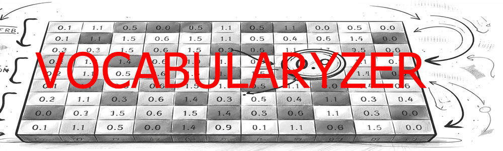

<h1 align="center"> FelipedelosH </h1>
 
<h4>Vocabylaryzer v2.0 By LoKo</h4>

 
:construction: In Construction :construction:
 

## What is this project?

**Femputadora** is a semantic vectorization engine that transforms Spanish text into high‑dimensional contextual vectors. Each word acts as a **“Contextual Iterator”** that activates specific dimensions of meaning, allowing sentences to be represented as arrays of values between 0 and 1.

**Vocabularyzer** is a tool designed to build, manage and structure semantic vocabularies for the Femputadora NLP system.
Instead of manually writing large and complex vocabulary files, this tool allows you to:

- Define semantic dimensions (like SUBJECT, VERB, EMOTION, etc.)
- Organize contextual words
- Generate structured vocabularies programmatically

This is the foundation layer of a custom NLP engine,The system is based on a semantic vector model, where:

- Each word represents a dimension in a vector
- Each dimension belongs to a semantic category
- Sentences are transformed into arrays of values between 0 and 1

Example: 

[0, 0.2, 0.9, 1, 0, ...]

Vocabularyzer helps you design that structure, before it becomes code.

## :hammer:Funtions:

- `Function 1: Semantic Dimension Creation`: Create new semantic categories (SUBJECT, VERB, TIME, etc.). 
- `Function 2: Contextual Iterators`: Define words that belong to each dimension. 
- `Function 3: Documentation`: Document meaning of each semantic group. 
- `Function 4: Vocabulary Loader`: Load existing vocabulary files and parse structure. 
- `Function 4: Construct`: Generate structured vocabularies programmatically. 

This is the foundation layer of a custom NLP engine. Vocabularyzer helps you design that structure before it becomes code.

## Core Concepts

### Semantic Dimension
A coordinate in the meaning space. Each dimension groups a set of related words (e.g., all subjects, all verbs, all emotions). The whole vector space is the concatenation of these dimensions.

### Contextual Iterator
Each word inside a dimension is an iterator. In the final vector, each word gets a one‑hot activation inside its own dimension block.

**Example with two dimensions:**
- Dimension “SUBJECT”: iterators `[yo, otro]`
- Dimension “VERB”: iterators `[hacer, dormir]`

Then the total vector length is 4:

| Word   | Vector         |
|--------|----------------|
| “yo”   | [1, 0, 0, 0]   |
| “otro” | [0, 1, 0, 0]   |
| “hacer”| [0, 0, 1, 0]   |
| “dormir”| [0, 0, 0, 1]   |

A sentence like “Yo me quede dormido” becomes `[1, 0, 0, 1]` (subject = “yo”, verb = “dormir”).

## Semantic Dimensions Used in Femputadora

- **SUBJECT** – who performs the action
- **VERB** – the action or state (most common verbs)
- **TIME** – past, present, future
- **PLACE** – where it happens
- **THEME** – topic (work, finances, health, dreams, relationships, etc.)
- **EMOTION** – joy, sadness, anger, etc.
- **INTENSITY** – much, little, nothing
- **NEGATION** – no, never (inverts the meaning)

## :play_or_pause_button:How to execute a project

Double‑click `main.py`

## :hammer_and_wrench:Tech.

- python
- Arrays
- Graphs

## :warning:Warning.

- The tool currently generates one‑hot vectors. Future versions will allow editing correlation values (synaptic weights) via the built‑in graph editor.
- Duplicate words across dimensions (e.g., “trabajo” in PLACE and THEME) are supported but affect indexing – use `keysContextualIterators` when processing vectors.

## Autor

| [ Andrés Felipe Hernánez](https://github.com/felipedelosh)|
| :---: |
