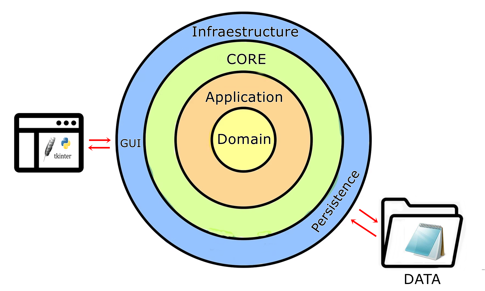

<h1 align="center"> FelipedelosH </h1>
<br>
<h4>Diario personal de Andrés felipe Hernández V2.0</h4>


<br>
:construction: Proyecto en construcción :construction:
<br><br>
Este es mi diario personal, aquí están escritos mis más intimos recuerdos, mis sueños (Zzz), conteo de lo que siento cada día, lo que vivo con los demás, mi situación economica, mis miedos y adiciones, mi asistente CHATBOT personal (FEMPUTADORA).

Es una aplicación de escritorio "SINGLE-USER" escrita en PYTHON+TKINTER que funciona como una caja de recuerdos personal. Es un entorno donde el autor registra, estructura y lee su propia vida — con la misma seriedad con la que se diseña un sistema para terceros, pero con un único usuario: él mismo.

No es un diario. Es un archivo vivo de una persona, con módulos para cada dimensión de su existencia.
<br><br>
Nota 01: se advierte que lo escrito aquí no tiene censura alguna.
<br>

# Architecture

```
DiarioPersonalV2.0/
├── Docs/
├── Application/
│   ├── UseCases/
│   ├── Services/
│   └── Repositories/
├── Domain/
│   └── Entities/
├── Infraestructure/
│   ├── config/
│   ├── GUI/
│   ├── Persistence/
│   ├── Repositories/
│   ├── Services/
│   └── UseCases/
├── config/
├── tests/
├── ASSETS/
├── DATA/
├── CORE/
│   └── Femputadora
├── main.py
└── readme.md
```


## :hammer:Funtions:

- `Function 0`: Seguridad de los datos con .env<br>
- `Function 1.0`: Guardar y cargar páginas del diario con cifrado Enigma.<br>
- `Function 1.1`: Guardar y cargar páginas de sueños (Zzz).<br>
- `Function 1.2`: Registrar el sentimiento (emoción) de cada día.<br>
- `Function 1.3`: Registrar el consumo de sustancias por día (detonante + efecto).<br>
- `Function 1.4`: Buscar y leer entradas del diario por palabra clave.<br>
- `Function 1.5`: Marcar entradas como secretas (cifradas) mediante interruptor.<br>
- `Function 2.0`: Guardar y cargar cuentas T (débito / crédito) por fecha.<br>
- `Function 2.1`: Registrar deudas con monto, interés, fecha límite y descripción.<br>
- `Function 2.2`: Abonar pagos parciales a una deuda.<br>
- `Function 2.3`: Saldar una deuda por completo y cambiar su estado.<br>
- `Function 2.4`: Ver historial de deudas con paginación.<br>
- `Function 2.5`: Buscar movimientos económicos por concepto y rango de fechas.<br>
- `Function 2.6`: Resumen total de ingresos y egresos.<br>
- `Function 3.0`: Registrar las 24 horas del día en franjas de actividad.<br>
- `Function 3.1`: Definir el horario habitual por día de la semana.<br>
- `Function 3.2`: Predecir el horario del día a partir del histórico.<br>
- `Function 3.3`: Visualizar calendario por año y mes.<br>
- `Function 4.0`: Gráfico de pastel de la economía (IN verde / OUT rojo).<br>
- `Function 4.1`: Gráfico de barras de la economía.<br>
- `Function 4.2`: Gráfico de línea de la economía segmentado por año.<br>
- `Function 4.3`: Histograma horizontal de consumo de drogas por año.<br>
- `Function 4.4`: Filtro de datos por rango de fechas (A/B) en la economía.<br>
- `Function 5.0`: Interfaz de chat con la Femputadora.<br>
- `Function 5.1`: Tokenización de texto en español (palabras y símbolos).<br>
- `Function 5.2`: Vectorización semántica por dimensiones (sujeto, verbo, tiempo, lugar, tema, emoción, intensidad, negación).<br>
- `Function 5.3`: Encoder posicional por token.<br>
- `Function 5.4`: Grafo de sinapsis semántica con rutas óptimas (Dijkstra).<br>
- `Function 5.5`: Modo pregunta, modo chat y modo gráfico del asistente.<br>
- `Function 6.0`: Multi-idioma (ES / EN) con LanguageManager.<br>
- `Function 6.1`: Generación automática de la estructura de carpetas de DATA/.<br>
- `Function 6.2`: Seguimiento de uso de la app (USOS/): diario, sueños, sentimientos, drogas, economía, deudas, horario.<br>
- `Function 6.3`: Generar archivo de respaldo consolidado (DATA/TEMP/all.txt).<br>
- `Function 6.4`: Inyección de dependencias centralizada (DependencyInjector).<br>
- `Function 6.5`: Contrato uniforme de respuesta (Response) en todos los casos de uso.<br>
- `Function 6.6`: Paginación genérica de resultados (Paginator).<br>
- `Function 6.7`: Registro de uso por año y tipo (USOS/{YYYY}-{tipo}.txt).<br>


## :play_or_pause_button:How to execute a project

```
python main.py
```

## :hammer_and_wrench:Tecnologías.

- Python
- .env
- .txt
- .csv
- .json

## :warning:Advertencia

- Este proyecto fue escrito en windows y no se han habilitado todas las funciones para linux.

## Autor

| [<br><sub>Andrés Felipe Hernánez</sub>](https://github.com/felipedelosh)|
| :---: |
