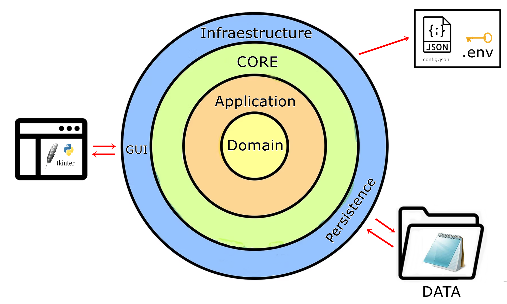

<h1 align="center"> FelipedelosH </h1>
<br>
<h4>Diario personal de Andrés felipe Hernández V2.0</h4>


<br>
:construction: Proyecto en construcción :construction:
<br><br>
Este es mi diario personal, aquí están escritos mis más intimos recuerdos, mis sueños (Zzz), conteo de lo que siento cada día, lo que vivo con los demás, mi situación economica, mis miedos y adiciones, mi asistente CHATBOT personal (FEMPUTADORA).
<br><br>
Nota 01: se advierte que lo escrito aquí no tiene censura alguna.
<br>

# Architecture

```
DiarioPersonalV2.0/
├── Docs/
├── Domain/
│   └── Entities/
├── Application/
│   ├── UseCases/
│   ├── Services/
│   └── Repositories/
├── Infraestructure/
│   ├── config/
│   ├── GUI/
│   ├── Persistence/
│   ├── Repositories/
│   ├── Services/
│   └── UseCases/
├── config/
├── tests/
├── ASSETS/
├── DATA/
├── CORE/
├── main.py
└── readme.md
```


## :hammer:Funtions:

- `Function 0`: Secure data via .env<br>
- `Function 1.0`: Save and Load Diary Pages with Enigma Encryp.<br>
- `Function 1.1`: Save and Load Dream Pages.<br>
- `Function 1.4`: Save feelings (emotions) peer day.<br>
- `Function 1.4`: Save drugs usa peer day.<br>
- `Function 2`: Save and Load monetary envents<br>
- `Function 3`: Neque porro quisquam est qui dolorem ipsum quia dolor sit amet.<br>
- `Function 3a`: Neque porro quisquam est qui dolorem ipsum quia dolor sit amet.<br>
- `Function 4`: Neque porro quisquam est qui dolorem ipsum quia dolor sit amet.<br>


## :play_or_pause_button:How to execute a project

```
python main.py
```

## :hammer_and_wrench:Tecnologías.

- Python
- .txt
- .csv
- .json

## :warning:Advertencia

- Este proyecto fue escrito en windows y no se han habilitado todas las funciones para linux.

## Autor

| [<br><sub>Andrés Felipe Hernánez</sub>](https://github.com/felipedelosh)|
| :---: |